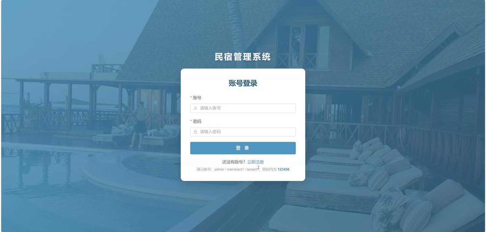
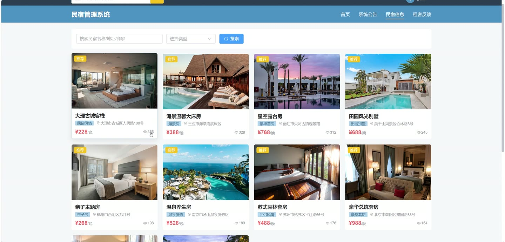
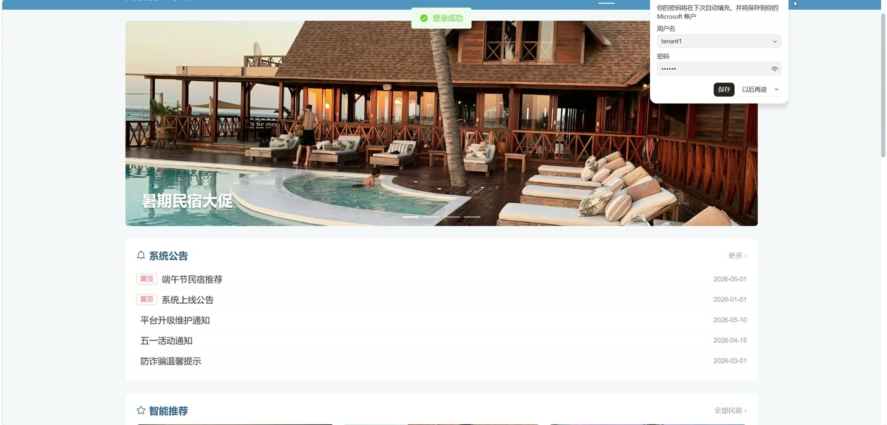
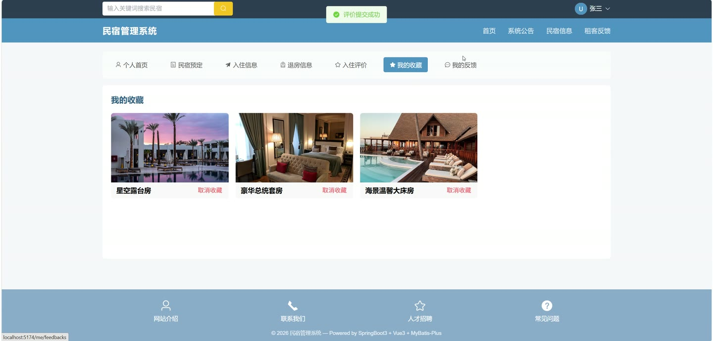
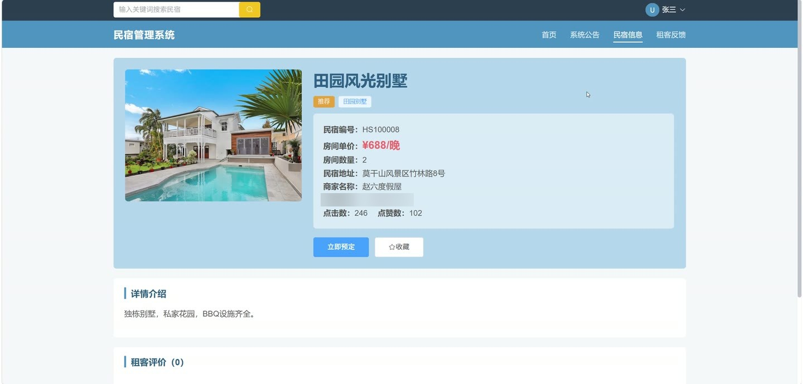
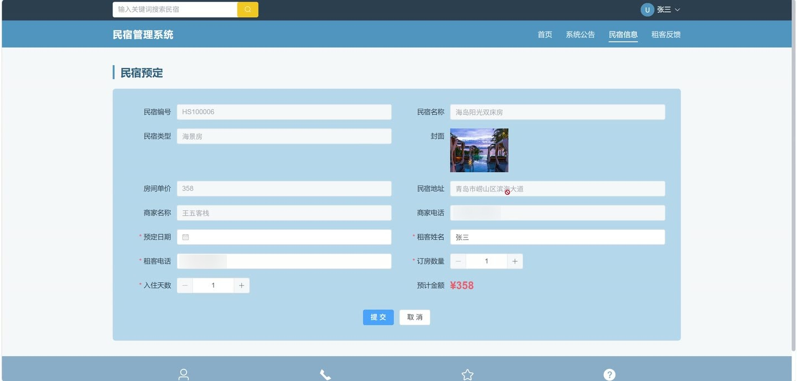

# (附文档)Springboot3+Vue3+MySQL 民宿预定系统

**技术栈**：Springboot3、Vue3、MySQL

### 系统简介

本系统是一套基于 Spring Boot 3 + Vue 3 + MySQL 的民宿预定管理平台，采用前后端分离架构。系统支持三种角色：管理员、商家（民宿主）、租客（普通用户），覆盖民宿展示、在线预定、订单审核、入住退房办理、评价反馈、数据统计等完整业务流程。
 
### 核心功能
 
### 普通用户端

 
- 浏览首页聚合数据：查看轮播图、最新公告、推荐民宿、热门民宿及民宿类型列表 
- 搜索民宿列表：按关键词（民宿名称/地址/商家名称）或民宿类型筛选，支持分页展示 
- 查看民宿详情：展示民宿基本信息、房型、地址、详细介绍，并自动累计浏览次数 
- 提交预定订单：选择入住日期、入住天数、房间数量，系统自动校验库存并扣减可用房间数 
- 查看我的预定列表：按订单状态（未审核/已通过/已入住/已完成/已取消）筛选，支持按订单号或民宿名称搜索 
- 申请取消预定：对未审核或已通过的订单提交取消申请，填写取消原因，等待商家审核 
- 查看入住记录：查看个人所有入住信息列表，包含入住日期、支付金额、支付方式 
- 查看退房记录：查看个人所有退房信息列表，包含退房日期、支付金额 
- 提交入住评价：对已完成订单进行评分（1-5分）和文字评价，评价后民宿点赞数自动+1 
- 管理我的收藏：对民宿进行收藏/取消收藏切换，查看已收藏民宿列表 
- 提交反馈：提交投诉/建议/咨询等反馈内容，支持上传截图附件 
- 查看反馈记录：查看个人提交的反馈列表及管理员回复 
- 个人中心管理：查看/修改个人信息（昵称、邮箱、头像、手机号），修改登录密码
 
### 商家端

 
- 查看商家工作台：统计民宿数量、总订单数、待审核订单数、已入住订单数、评价数 
- 管理民宿信息：新增/编辑/删除民宿，设置民宿名称、类型、封面、价格、房间数、地址、详细介绍 
- 上下架民宿：一键切换民宿的上架/下架状态 
- 查看民宿列表：按民宿名称或上架状态筛选自家民宿 
- 处理预定订单：查看所有预定订单，支持通过/拒绝操作，拒绝时自动释放占用的房间数 
- 审核取消申请：查看租客提交的取消申请，支持同意/拒绝，同意后释放房间并更新订单状态 
- 办理入住：对已通过的订单办理入住，记录入住日期、支付方式，自动计算应付金额，订单状态变为已入住 
- 办理退房：对已入住的订单办理退房，记录退房日期，订单状态变为已完成 
- 查看评价：查看租客对自家民宿的评价内容及评分
 
### 管理员端

 
- 查看后台首页仪表盘：统计用户总数、商家数、租客数、民宿数、总订单数、今日订单数、待处理反馈数、待审核取消数 
- 管理系统用户：查看用户列表（按角色/状态/关键词筛选），新增/编辑用户，重置用户密码，启用/禁用用户，删除用户 
- 管理商家资质：查看商家列表（按商家名称/审核状态筛选），审核商家入驻申请（通过/拒绝并填写回复） 
- 管理租客信息：查看租客列表，按租客名称搜索 
- 管理民宿信息：查看所有民宿（按名称/类型/上架状态筛选），新增/编辑/删除民宿 
- 管理民宿类型：查看/新增/编辑/删除民宿类型，支持排序 
- 管理订单：查看所有预定订单（按订单号/民宿名称/状态筛选） 
- 管理取消申请：查看所有取消申请记录，按状态筛选 
- 管理入住/退房记录：查看所有入住和退房记录 
- 管理评价：查看所有用户评价内容 
- 管理反馈：查看租客反馈列表，处理反馈（标记已处理并填写回复） 
- 管理轮播图：新增/编辑/删除首页轮播图，设置标题、图片链接、排序、是否显示 
- 管理系统公告：新增/编辑/删除公告，支持置顶设置
 
### 技术栈

 后端框架Spring Boot 3 ORMMyBatis-Plus 权限认证Spring Security + JWT 前端框架Vue 3 状态管理Pinia 构建工具Vite 数据库MySQL
 
### 交付内容

 
- 后端完整源码 
- 前端完整源码 
- 数据库初始化脚本 
- 万字文档

## 界面展示

---

## 获取完整源码 + 万字文档

本仓库为项目介绍页。**完整前后端源码、数据库初始化脚本、万字项目文档**，请加微信 `kangkangcode`，或访问 [codekk.top](http://codekk.top) 获取。

可作课程设计 / 毕业设计参考，支持远程部署调试。